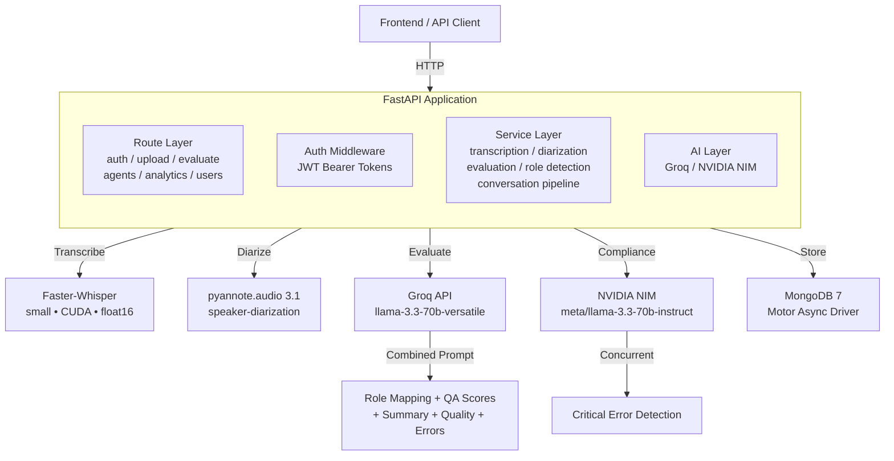
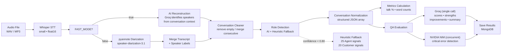
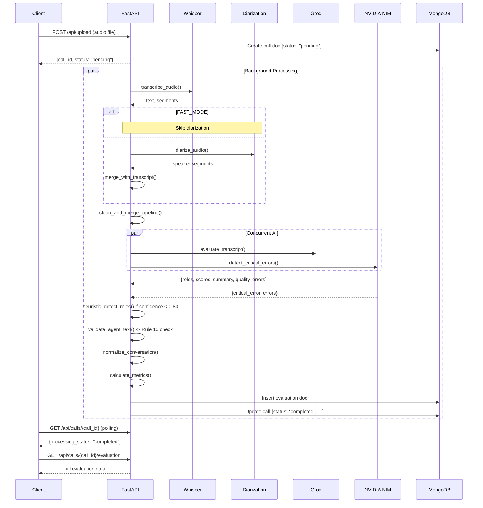
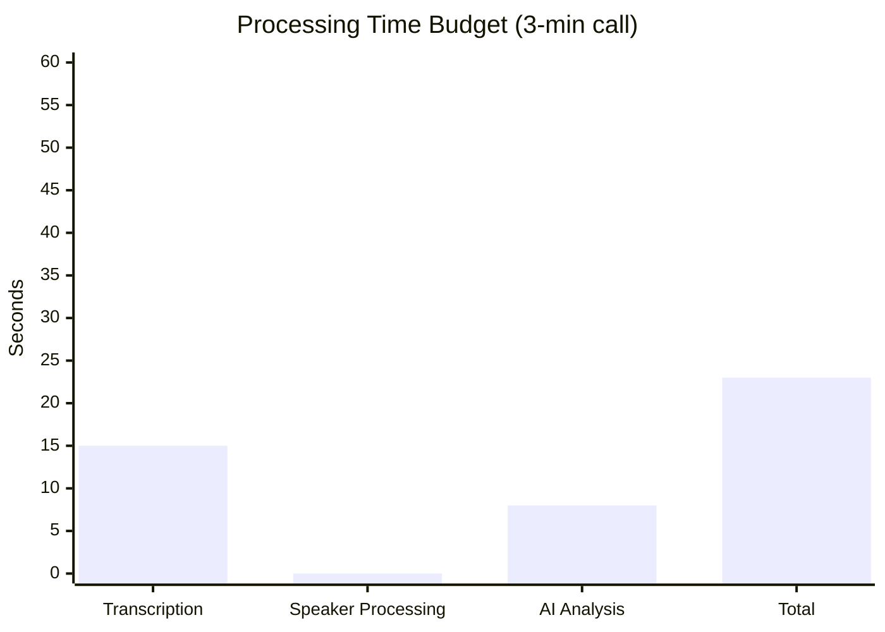

# CallAudit Backend — AI-Powered Call QA Pipeline

FastAPI-based backend for analyzing call center recordings with automated transcription, speaker diarization, AI evaluation, and compliance detection.

---

## Architecture Overview



---

## Processing Pipeline



---

## Data Flow — Single Call Evaluation



---

## API Endpoints

### Authentication

| Method | Path | Auth | Description |
|--------|------|------|-------------|
| `POST` | `/api/auth/register` | — | Register a new user |
| `POST` | `/api/auth/login` | — | Login, returns JWT token |
| `GET` | `/api/auth/me` | JWT | Get current user profile |

### Call Management

| Method | Path | Auth | Description |
|--------|------|------|-------------|
| `POST` | `/api/upload` | JWT | Upload audio file (starts async processing) |
| `GET` | `/api/calls` | JWT | List all calls (sorted by date desc) |
| `GET` | `/api/calls/{call_id}` | JWT | Get call details + processing status |
| `GET` | `/api/calls/{call_id}/evaluation` | JWT | Get evaluation for a call (with call data) |
| `DELETE` | `/api/calls/{call_id}` | Admin | Delete a call |

### Evaluation

| Method | Path | Auth | Description |
|--------|------|------|-------------|
| `POST` | `/api/evaluate/{call_id}` | JWT | Trigger synchronous evaluation |
| `GET` | `/api/evaluation/{evaluation_id}` | JWT | Get evaluation result + call data |
| `GET` | `/api/evaluations` | JWT | List all evaluations |

### Agent Management

| Method | Path | Auth | Description |
|--------|------|------|-------------|
| `POST` | `/api/agents` | Admin | Create a new agent |
| `GET` | `/api/agents` | JWT | List all agents (with avg score) |
| `GET` | `/api/agents/{agent_id}` | JWT | Get agent details + stats |
| `DELETE` | `/api/agents/{agent_id}` | Admin | Delete an agent |
| `POST` | `/api/agents/{agent_id}/upload` | Admin | Upload + evaluate call for agent |
| `GET` | `/api/agents/{agent_id}/evaluations` | JWT | List evaluations for an agent |

### Analytics

| Method | Path | Auth | Description |
|--------|------|------|-------------|
| `GET` | `/api/analytics/summary` | JWT | Aggregate analytics (avg scores, totals) |
| `GET` | `/api/analytics/trends` | JWT | Monthly score trends |
| `GET` | `/api/analytics/categories` | JWT | Per-category score breakdown |

### Performance

| Method | Path | Auth | Description |
|--------|------|------|-------------|
| `GET` | `/api/performance` | JWT | Average timing per pipeline stage |
| `DELETE` | `/api/performance` | JWT | Reset timing data |

### User Management (Admin)

| Method | Path | Auth | Description |
|--------|------|------|-------------|
| `GET` | `/api/users/` | Admin | List all users |
| `POST` | `/api/users/` | Admin | Create a user |
| `DELETE` | `/api/users/{user_id}` | Admin | Delete a user |

> **Total: 21 endpoints** across 7 route modules.

---

## Project Structure

```
backend/
├── app/
│   ├── main.py                 # FastAPI app, lifespan, CORS, router registration
│   ├── config.py               # Environment variables + performance flags
│   ├── database.py             # Motor MongoDB connection manager
│   │
│   ├── auth/
│   │   ├── hashing.py          # bcrypt password hashing
│   │   └── token_utils.py      # JWT create/decode, get_current_user, require_role
│   │
│   ├── models/                 # MongoDB document factories
│   │   ├── call.py             # call document schema
│   │   ├── evaluation.py       # evaluation document schema
│   │   ├── agent.py            # agent document schema
│   │   └── user.py             # user document schema
│   │
│   ├── routes/                 # API route handlers
│   │   ├── auth.py             # /api/auth/*
│   │   ├── upload.py           # /api/upload, /api/calls/*
│   │   ├── evaluate.py         # /api/evaluate/*, /api/evaluation/*
│   │   ├── agents.py           # /api/agents/*
│   │   ├── analytics.py        # /api/analytics/*
│   │   ├── users.py            # /api/users/*
│   │   └── performance.py      # /api/performance
│   │
│   ├── services/               # Business logic layer
│   │   ├── transcription.py    # Faster-Whisper STT (small, CUDA, float16)
│   │   ├── diarization.py      # pyannote.audio speaker diarization
│   │   ├── conversation_cleaner.py    # Parse, clean, merge segments
│   │   ├── role_identifier.py         # Combined Groq prompt definition
│   │   ├── role_detector.py           # Heuristic role detection (25+ signals)
│   │   ├── conversation_normalizer.py # Structured conversation + metrics
│   │   ├── evaluation_service.py      # Pipeline orchestrator (FAST_MODE)
│   │   └── timing.py                  # Per-stage timing tracker
│   │
│   ├── ai/                     # External AI clients
│   │   ├── groq_client.py      # Groq API (combined prompt)
│   │   └── nim_client.py       # NVIDIA NIM API (error detection)
│   │
│   └── uploads/                # Stored audio files
│
├── Dockerfile
├── requirements.txt
├── Pipfile
└── .env
```

---

## Technology Stack

| Component | Technology | Purpose |
|-----------|-----------|---------|
| **Framework** | FastAPI 0.115 | Async Python web framework |
| **ASGI Server** | Uvicorn 0.30 | High-performance ASGI server |
| **Database** | MongoDB 7 + Motor 3.6 | Async document storage |
| **STT** | Faster-Whisper 1.1 | Speech-to-text (small, CUDA) |
| **Diarization** | pyannote.audio 3.1 | Speaker diarization |
| **QA Evaluation** | Groq (llama-3.3-70b) | Combined evaluation prompt |
| **Compliance** | NVIDIA NIM (llama-3.3) | Critical error detection |
| **Auth** | PyJWT 2.9 + bcrypt 4.2 | JWT token authentication |

---

## Environment Variables

| Variable | Required | Default | Description |
|----------|----------|---------|-------------|
| `MONGODB_URI` | Yes | `mongodb://localhost:27017/call_qa` | MongoDB connection string |
| `GROQ_API_KEY` | Yes* | — | Groq API key (required for AI eval) |
| `NVIDIA_API_KEY` | No | — | NVIDIA NIM API key |
| `HF_TOKEN` | No | — | HuggingFace token (for diarization) |
| `JWT_SECRET` | No | `call-qa-secret-key-change-in-production` | JWT signing secret |
| `FAST_MODE` | No | `true` | Skip diarization, use AI reconstruction |
| `GPU_ACCELERATION` | No | `true` | Enable CUDA for Whisper + pyannote |

> *`GROQ_API_KEY` is required for AI-powered evaluation. Without it, all scores default to fallback values.

---

## Performance Targets



| Stage | FAST_MODE | LEGACY_MODE | Target |
|-------|-----------|-------------|--------|
| Transcription | 10–15s | 10–15s | < 20s |
| Speaker Processing | 0s (AI) | 30–60s | < 5s |
| AI Analysis (Groq + NIM) | 5–8s | 5–8s | < 10s |
| **Total** | **~23s** | **~90s+** | **< 45s** |

---

## Processing Rules (Conversation Intelligence Layer)

### Rule 1: Agent Introduction Detection (+50)
Patterns: `"this is <name>"`, `"I'm calling from"`, `"my name is"`, `"calling from"`

### Rule 2: Product Explanation Detection (+30)
Patterns: `"launch"`, `"discount"`, `"offer"`, `"pricing"`, `"package"`

### Rule 3: Conversation Leadership
Questions asked, total word count, leadership signals

### Rule 4: Customer Behavior Detection (+10)
Short responses: `"yes"`, `"okay"`, `"sure"`, `"let me check"`, `"send details"`

### Rule 5: Long Monologue Protection
Prevents incorrect speaker switching during product explanations

### Rule 6: Consecutive Segment Merge
Same-speaker messages are merged into single utterances

### Rule 7: AI Validation (Groq)
Single combined prompt returns role mapping + QA scores + summary + quality + errors

### Rule 8: Confidence Threshold
Heuristic fallback when AI confidence < 0.80

### Rule 9: QA Evaluation Source
Always evaluates normalized conversation, never raw transcript

### Rule 10: Automatic Validation
Checks Agent text contains introduction + company mention. Reruns correction if not.

---

## QA Scoring Categories

| Category | Max | Description |
|----------|-----|-------------|
| Opening Score | 10 | Greeting, introduction, company name, purpose |
| Communication | 15 | Clarity, confidence, grammar, professionalism |
| Active Listening | 15 | Interruptions, acknowledgment, follow-ups |
| Product Knowledge | 15 | Correct info, explanation, objection handling |
| Discovery | 10 | Probing questions, needs analysis |
| Call Control | 10 | Logical flow, focus, objection management |
| Professionalism | 10 | Respect, empathy, positive attitude |
| Compliance | 5 | Required disclosures, confidentiality |
| Closing | 5 | Summary, next steps, professional ending |
| **Overall** | **100** | Sum of all category scores |

---

## Quick Start

```bash
# 1. Clone and enter backend
cd backend

# 2. Install dependencies
pip install -r requirements.txt

# 3. Configure environment
cp .env.example .env
# Edit .env with your API keys

# 4. Start MongoDB
docker run -d -p 27017:27017 mongo:7

# 5. Run the server
uvicorn app.main:app --reload --host 0.0.0.0 --port 8000
```

### Docker Deployment

```bash
# From project root
docker compose up -d
```

### API Documentation

Once running:
- **Swagger UI**: http://localhost:8000/docs
- **ReDoc**: http://localhost:8000/redoc
- **Performance**: GET http://localhost:8000/api/performance
